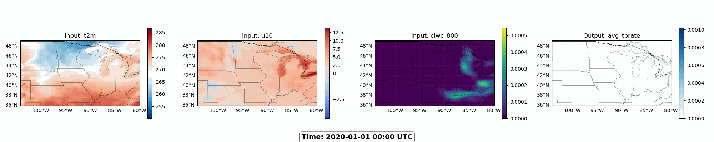

# ERA5 Data Loader for AI/ML Applications

A data loader for unified ERA5 datasets that combines surface and pressure level data in single files. This repository provides tools for loading, processing, and visualizing ERA5 meteorological data for machine learning applications.

## Features

- **Unified Data Loading**: Handles combined surface and pressure level ERA5 data
- **Flexible Channel Selection**: Choose specific input and output channels for your ML models
- **Efficient Data Processing**: Uses Dask and Zarr for optimized data loading
- **Visualization Tools**: Built-in functions for data visualization and animation
- **PyTorch Integration**: Native PyTorch Dataset and DataLoader support
- **Subset Support**: Create custom subsets for testing and validation
- **Multi-year Support**: Load data across multiple years seamlessly

## Repository Structure

```
ai_for_earth_era5/
├── data_loader.py           # Core data loading functionality
├── using_data_loader.py     # Visualization and usage examples
├── config.yaml             # Configuration file with parameters
├── utils/
│   ├── YParams.py          # YAML parameter parsing utilities
│   └── BiMap.py            # Bidirectional mapping utilities
├── visualization_outputs/  # Generated visualizations (ignored by git)
└── README.md               # This file
```

## Installation

### Prerequisites

- Python 3.8+
- PyTorch
- Required Python packages:

```bash
pip install torch torchvision numpy xarray zarr dask matplotlib
```

### Setup

1. Clone the repository:
```bash
git clone <repository-url>
cd ai_for_earth_era5
```

2. Download your ERA5 data from [this Google Drive link](https://drive.google.com/drive/folders/1PZuRM7lbX-pBV0Zk34-2RZ3X283DYxex?usp=sharing) and place them in a directory and decompress them.

3. Update the `DATA_ROOT` variable in `data_loader.py` to point to your data directory.

## Quick Start
### Testing the Data Loader

Run the built-in test script:

```bash
# Test with visualization
python data_loader.py --config base --visualize
```

## Configuration

The `config.yaml` file contains all configuration parameters:

### Available ERA5 Channels


*Animation showing atmospheric inputs and precipitation output over time*

**Surface Variables:**
- `u10`, `v10`: 10m wind components
- `t2m`: 2m temperature  
- `sst`: Sea surface temperature
- `skt`: Skin temperature
- `lsm`: Land-sea mask

**Pressure Level Variables:**
- `z_1000`, `z_600`, `z_200`: Geopotential at different levels
- `clwc_800`, `clwc_600`, `clwc_400`: Cloud liquid water content at different levels
- `ciwc_800`, `ciwc_600`, `ciwc_400`: Cloud ice water content at different levels
- `q_1000`, `q_800`, `q_600`: Specific humidity at different levels
- `t_800`, `t_600`, `t_400`: Temperature at different levels
- `u_800`, `u_600`, `u_400`: U-wind component at different levels
- `v_800`, `v_600`, `v_400`: V-wind component at different levels

**Output Variables:**
- `avg_tprate`: Average total precipitation rate
