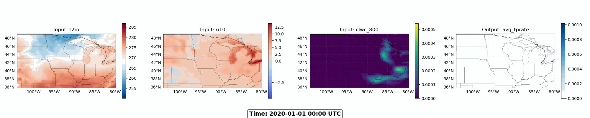

# ERA5 Precipitation Modeling Project

---

## Project Overview - Predicting Precipitation with AI

### **Project Goal**
**Use atmospheric data to predict precipitation patterns with machine learning**

### **What is ERA5?**
- **ERA5** = European Centre for Medium-Range Weather Forecasts Reanalysis v5
- Global atmospheric reanalysis dataset covering 1940-present
- Combines observations with weather models to create complete atmospheric state
- **Resolution**: ~31km globally, hourly temporal resolution
- **Gold standard** for atmospheric research and ML applications

### **Our Dataset**
- **Region**: US Midwest (agricultural region prone to extreme weather)
- **Time Period**: 2020-2023 (4 years of data)
- **Target**: Predict average precipitation rate (`avg_tprate`)
- **Features**: 27 atmospheric variables at multiple pressure levels

### **Why This Matters**
- **Agriculture**: Crop planning and irrigation management
- **Disaster Preparedness**: Early warning systems for floods/droughts
- **Climate Research**: Understanding precipitation patterns and changes

---

## Input Features - The Atmospheric "Recipe" for Precipitation


*Animation showing atmospheric inputs and precipitation output over time*

### **Surface Variables** (What we feel)
- **Wind**: `u10`, `v10` - 10-meter wind speed components
- **Temperature**: `t2m` - 2-meter air temperature  
- **Surface**: `sst` (sea surface temp), `skt` (skin temp), `lsm` (land-sea mask)

### **Atmospheric Profile** (What's happening above)
**5 Pressure Levels**: 1000hPa (surface), 800hPa (mid), 600hPa (upper), 400hPa (jet stream), 200hPa (stratosphere)

| Variable | Physical Meaning | Why Important for Precipitation |
|----------|------------------|--------------------------------|
| **Geopotential** (`z_*`) | Height of pressure surfaces | Shows atmospheric waves, storm systems |
| **Temperature** (`t_*`) | Air temperature at altitude | Determines precipitation type (rain/snow) |
| **Humidity** (`q_*`) | Water vapor content | More moisture = more potential precipitation |
| **Wind** (`u_*`, `v_*`) | Horizontal wind components | Transports moisture, creates convergence |
| **Cloud Water** (`clwc_*`, `ciwc_*`) | Liquid/ice in clouds | Direct precursor to precipitation |

### **The ML Challenge**
**27 input channels: Atmospheric states** → **Neural Network** → **1 output channel: precipitation rate**

---

## Technical Implementation & Results

### **Data Pipeline**
```python
# Our data loader handles:
Input Shape:  [batch_size, input_channel_size, lat, lon]  # Atmospheric state
Output Shape: [batch_size, output_channel_size, lat, lon]   # Precipitation map
```

###  **Technical Features**
- **Unified Dataset**: Surface + pressure level data in single files
- **Efficient Loading**: Zarr format with Dask for large datasets
- **PyTorch Integration**: Ready for deep learning workflows
- **Flexible Channels**: Select specific atmospheric variables
- **Visualization Tools**: Compare inputs/outputs, create animations

### **Data Characteristics**
- **Spatial**: 53×97 grid covering US Midwest
- **Temporal**: 6-hour intervals (4 samples per day)
- **Training**: 2020-2022
- **Validation**: 2023

### **Learning Objectives for Students**
1. **Understand** how atmospheric variables relate to precipitation
2. **Experience** working with real-world meteorological datasets
3. **Apply** deep learning to scientific prediction problems
4. **Visualize** and interpret high-dimensional atmospheric data

### **Next Steps**
- **Model Architecture**:  U-Net or Transformer-based models
- **Evaluation Metrics**: RMSE, correlation, precipitation detection skill
---

<!-- ## Presentation Tips (10-minute timing)
- **Slide 1**: 3 minutes - Focus on motivation and ERA5 importance
- **Slide 2**: 4 minutes - Explain variables and their physical meaning
- **Slide 3**: 2 minutes - Technical overview and learning objectives  
- **Slide 4**: 1 minute - Quick demo or questions

### Key Talking Points:
1. **Start with impact**: "Weather affects everything - agriculture, disasters, daily life"
2. **Make it relatable**: "Think about checking weather apps - this is the data behind them"
3. **Emphasize scale**: "27 variables, 4 years, millions of data points"
4. **Connect to ML**: "Perfect example of supervised learning with spatial data"
5. **End with excitement**: "You could improve weather forecasting!" -->
